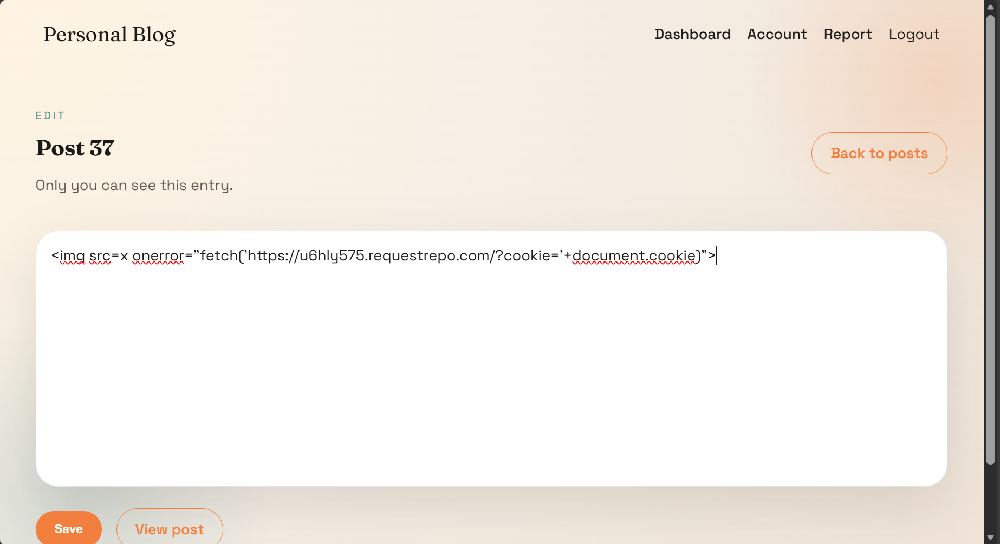
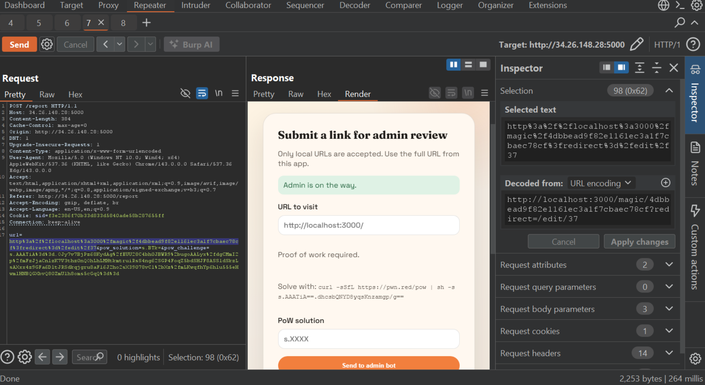

# Personal Blog

---
## Overview
- **Platform**: UofTCTF
- **Category**: Web
- **Difficulty**: Easy-Medium (subjective)
- **Goal**: Trick admin bot to access attacker-controlled page, which is polluted with XSS, then read Admin's cookie and read flag at Admin site

## Recon
- There is a bot getting link, checking if the link is internal, accessing the link and waiting for 6 seconds
  
Menu: 
    - Dashboard contains post
        Allow view and edit 
        Edit has *autosave* function applied on client-side => bypass 
    - Account contains *magic link* (token) 
    - Report used for sending link to admin bot for review if solve the challenge 
- SameSite: Lax => CRSF via GET request
- HttpOnly: false => XSS reads cookie
- Server creates new session id after login and access url via *magic link* 
Endpoints:
    - /dashboard        only display savedCotent (sanitize server-side) => can't XSS at dashboard => skip
    - /post/:id         only display savedCotent (sanitize server-side) => can't XSS at post/:id => skip
    - /report           allow sending link to internal endpoint, pow_challenge and pow_solution
    - /edit (GET) 
        -- /edit 
        -- /edit/new        

        -- /edit/:id    this page has autosave functionality which sanitizes draft content on client-side and sends **SAVE** request to **api/autosave** for each 30 seconds

    - /api 
        -- /api/save        (DOMpurify = sanitize server-side => skip) 
        -- /api/autosave    (blindly trust and store data from browser) 
    - /account
    - /magic
        -- /magic/generate (POST) 
        -- /magic/:token   (GET)    receives one query *redirect*, user-controlled *redirect* value  
    - /flag (Admin only)
## Analysis

- Since only admin can read the flag (server check session id) => We want to steal admin's cookie
- Endpoint **/edit/:id** is vulnerable to XSS => trick admin to access this page
- **/magic/:token** allows redirection to same hot endpoints, create new session id as accessing the link. **However it stores previous cookie as *sid_prev* without discard it????** => Admin clicks link and admin's cookie is reserved.
- Endpoint **/report** allows users to post challenge and solution => users control both of them

## Attack Flow

First create a draft at */edit:id* with XSS payload ``, wait for browser to automatically send sanitized request, use BurpSuite to capture the request and *unsanitize* it.

At this step, we must get to other page quickly, otherwise browser may resend sanitized request.

Next, create solution and challenge. At this stage, I choose a number (which is solution), run `powGenerateSolution()` to get *challenge*, format them. You can refer to [my script](my_script.js) to get ready-to-use challenge and solution.

Then proceed to generate a magic link in /account, send url with **query** is /edit/:id (id is the id post of your post with XSS payload)

My payload:
- url: `http://localhost:3000/magic/4dbbead9f82e1161ec3a1f7cbaec78cf?redirect=/edit/37`
- pow_solution: `s.BTk=`
- pow_challenge: `s.AAATiA%3d%3d.OJy7v7BjPz68KydAg%2fEUU28C4bh0JBWR9%2bugoAALyx%2fdgCMmI2p%2fmFzJjaCnlzK7V3thz0nQOhLhLMHtkmtruiRsS4ng62SGP4FoqZ5bdSHJF8ASS1dSkzLsAXxx4z9GFa6DltJRSdkqjgru8aF16J2ho2sX39078vCl%2bXz%2fmLKwqfhYp6hlu555eHwmlHNBQGXbvQ80ZmU1h8oms5cGqQ%3d%3d`

Send link and wait at Requestrepo for callback

Admin's cookie is the sid_prev 
Replace the cookie and get flag at */flag*

> Flag: *uoftctf{533M5_l1k3_17_W4snt_50_p3r50n41...}*
